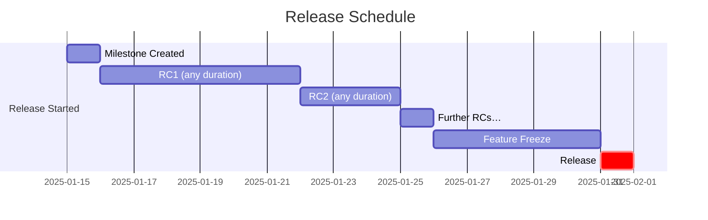

# Contributing

## Making a PR

If you would like to contribute to EvidenceAngel, please base your work on the
`next` branch, as this will be the most up-to-date starting point for you to
work from. We thank you for your contribution!

## Release Schedule

We do not have a fixed release schedule, however when we do have new features to
implement, that triggers the release process:

1. A [milestone] is created for the release with a due date at least 10 days (up
   to a maximum of 6 weeks) in the future on a Wednesday.
1. Release candidates are produced (from the `next` branch) as needed to
   introduce and test the new features and fix any early bugs.
1. A feature freeze is started, that is, no new features are permitted in
   release candidates, only bugfixes. New features are now delayed until the
   next release (and a new milestone can be created at this point if needed).
   This is 5 days before the release, i.e. the end of business hours on the
   Friday preceding release.
1. The latest release candidate is promoted to release (i.e. the `next` branch
   is merged to `main` with ONLY a version number change to remove the `-rc.X`
   suffix) on the milestone due date. The milestone should be closed.

As a Gantt chart, with an example release date of the 31st Jan 2025:

## Updates to Dependencies Only

If dependencies have been updated, it is wise to update EvidenceAngel. If there
is no need for a full release, this can be done via a patch.

## Patches

Patches can be released as often as needed, however must ONLY contain bugfixes
and dependency updates. They do not go through the same cycle as full releases.

[milestone]: https://github.com/lilopkins/evidenceangel/milestones
