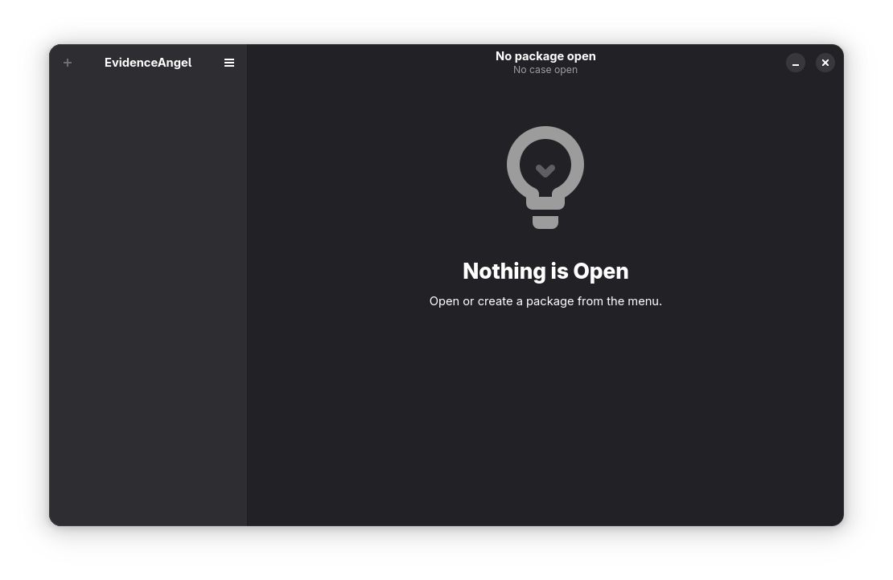
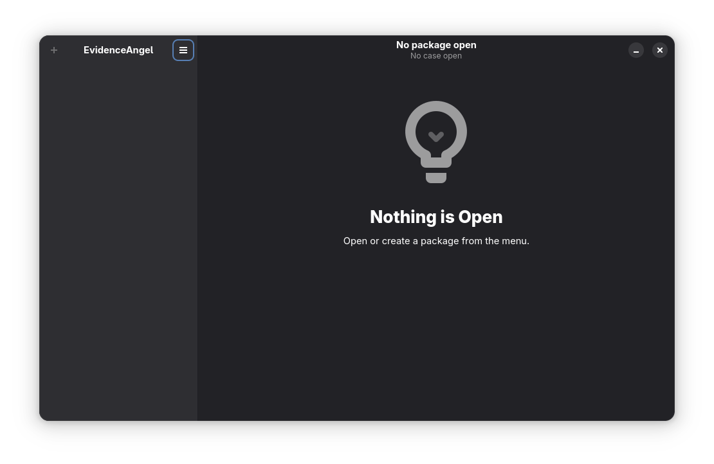
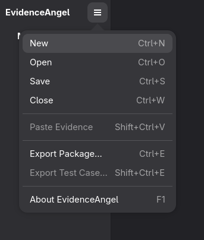
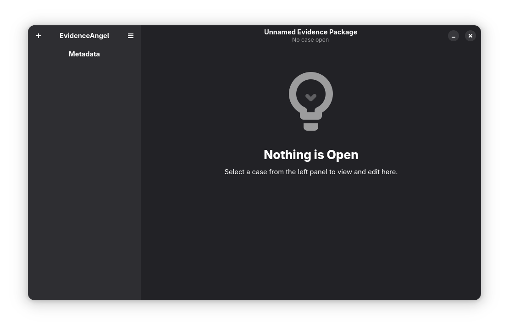
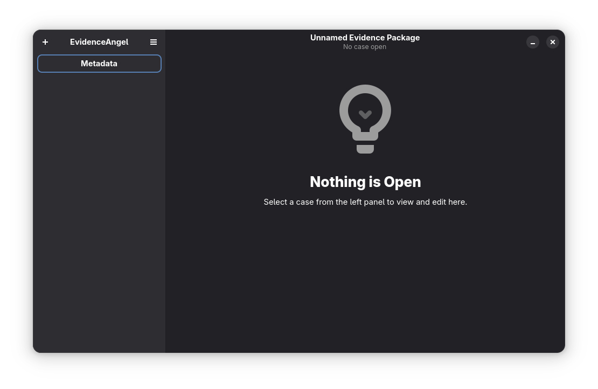
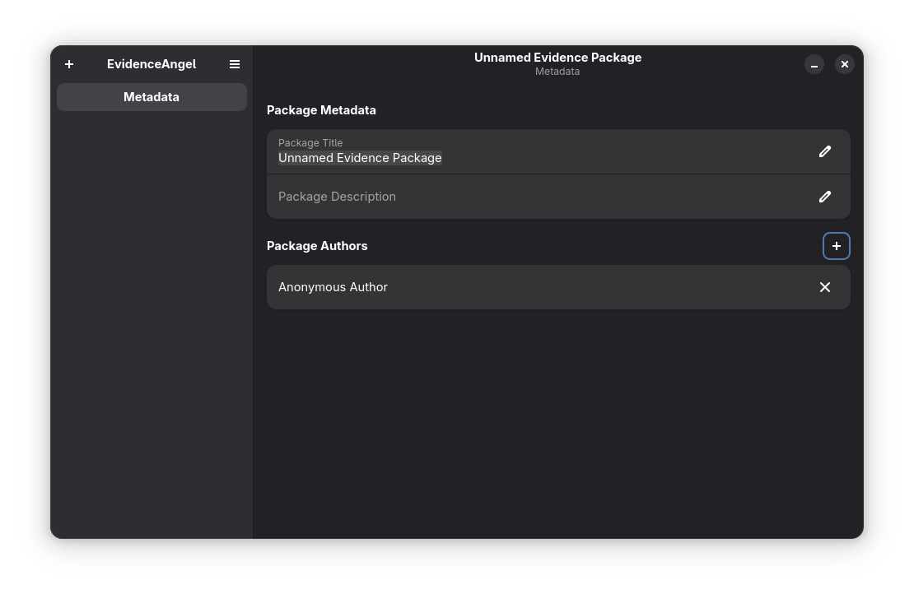

# Creating an Evidence Package

When you first open EvidenceAngel, you will be greeted with a blank screen:

To create a new [_evidence package_](./glossary.html#evidence-package):

1. Select the main menu.

   
1. Select "New".

   
1. Choose a file path to save your new _evidence package_. (Note: you have to
   choose a path when you create a file in EvidenceAngel in order to help
   prevent data loss in the event of a power cut)
1. You will now have an _evidence package_ open (notice the "Unnamed Evidence
   Package" at the top of the window), but no [_test
   case_](./glossary.md#test-case).

   
1. Select the "Metadata" tab.

   
1. From here, you can rename the package, add a description, and add authors
   with the "+" button near "Package Authors".

   
1. You can also remove authors by clicking the "×" near their name.

   
1. You can now continue by [creating a _test case_](./creating_a_test_case.md).
