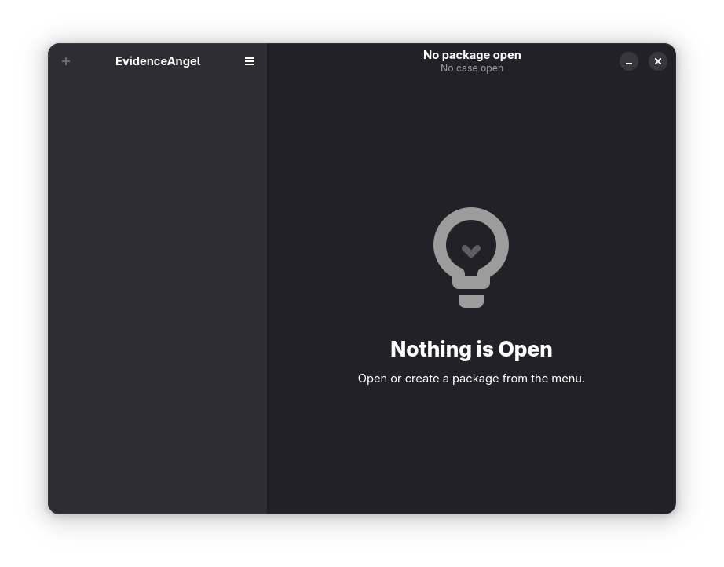
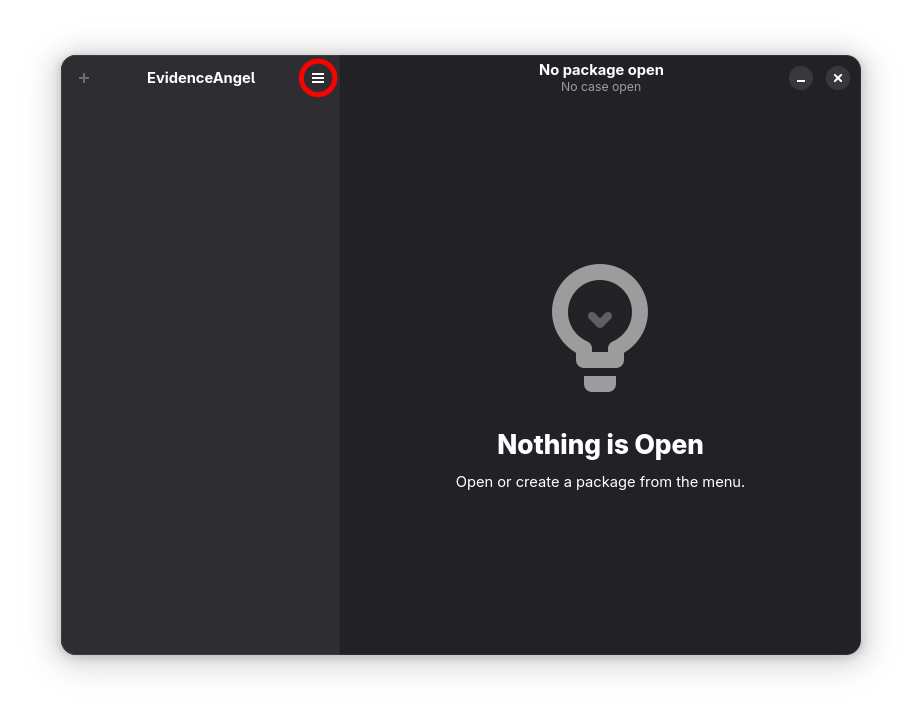
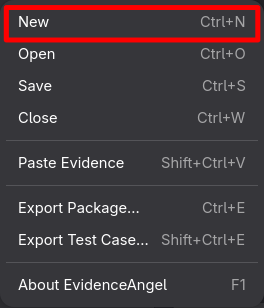
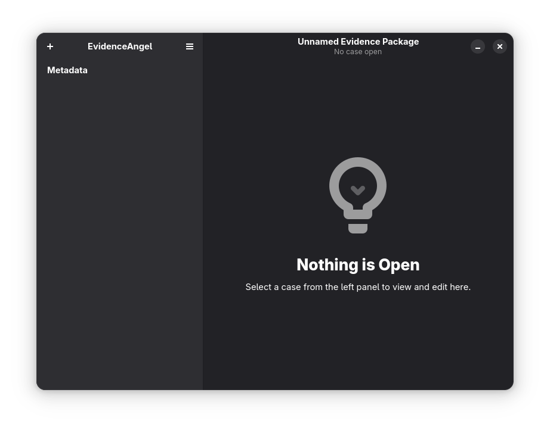
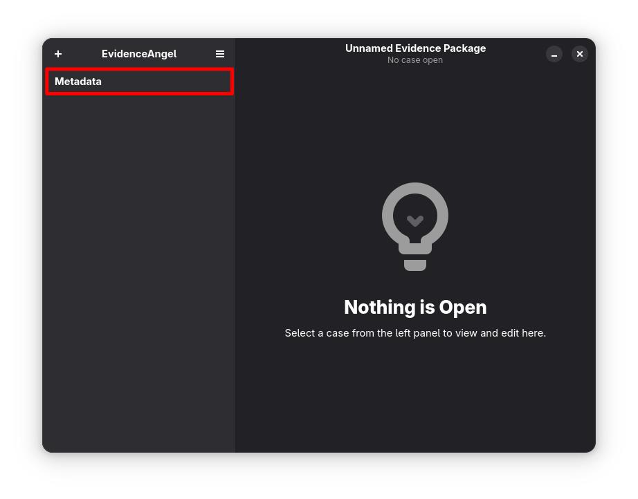
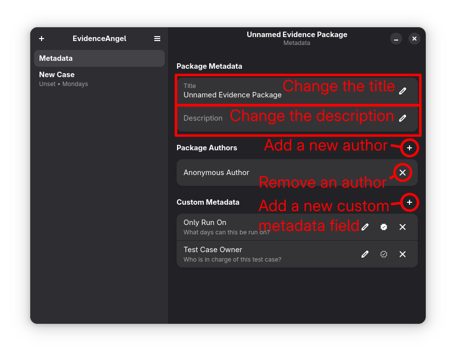
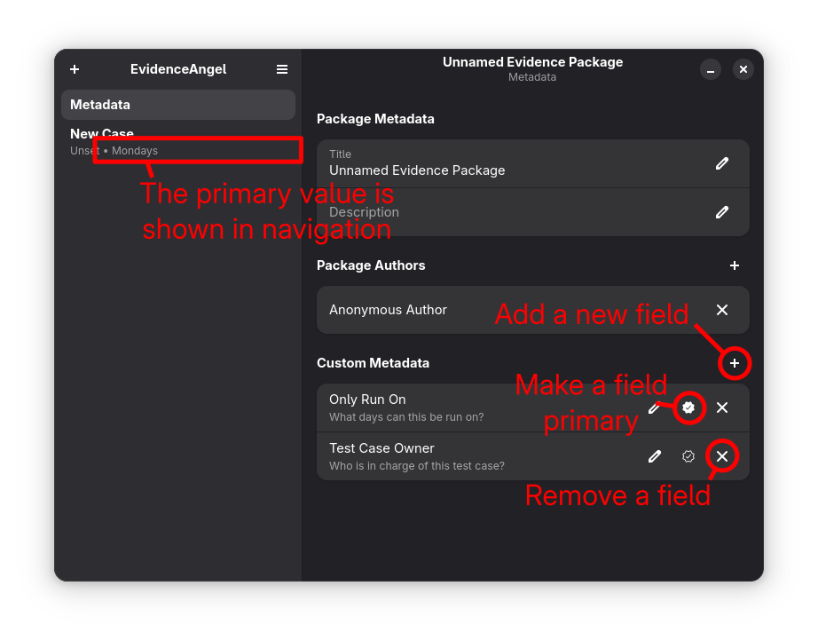

# Creating an Evidence Package

When you first open EvidenceAngel, you will be greeted with a blank
screen:

To create a new [_evidence package_](./glossary.html#evidence-package):

1. Select the main menu.

   
1. Select "New".

   
1. Choose a file path to save your new _evidence package_. (Note: you
   have to choose a path when you create a file in EvidenceAngel in
   order to help prevent data loss in the event of a power cut)
1. You will now have an _evidence package_ open (notice the "Unnamed
   Evidence Package" at the top of the window), but no [_test
   case_](./glossary.md#test-case).

   
1. Select the "Metadata" tab.

   
1. From here, you can rename the package, add a description, and add
   authors with the "+" button near "Package Authors".

   
1. You can now continue by [creating a _test case_](./creating_a_test_case.md).

## Custom Metadata Fields

> **TIP**: Come back to this section once you've started getting used to
> EvidenceAngel. This is a more advanced feature!

You can create extra fields for test case metadata. These are created
per package and are set per test case. You can use them to keep track of
additional data, for example who is responsible of managing a particular
test case, or a particular environment you are working in.

When you create a new custom metadata field, you'll be asked for a name,
description, and internal ID. You can leave the internal ID blank if
you'd like, it'll be randomly generated internally, however it is often
worth giving it a short name, maybe something like `test-case-owner` or
`EnvironmentDetails`. It must be unique.

Optionally, one of the custom fields can be marked as "primary". This
will make the value set for this field in each test case appear under
it's name in the left navigation.

