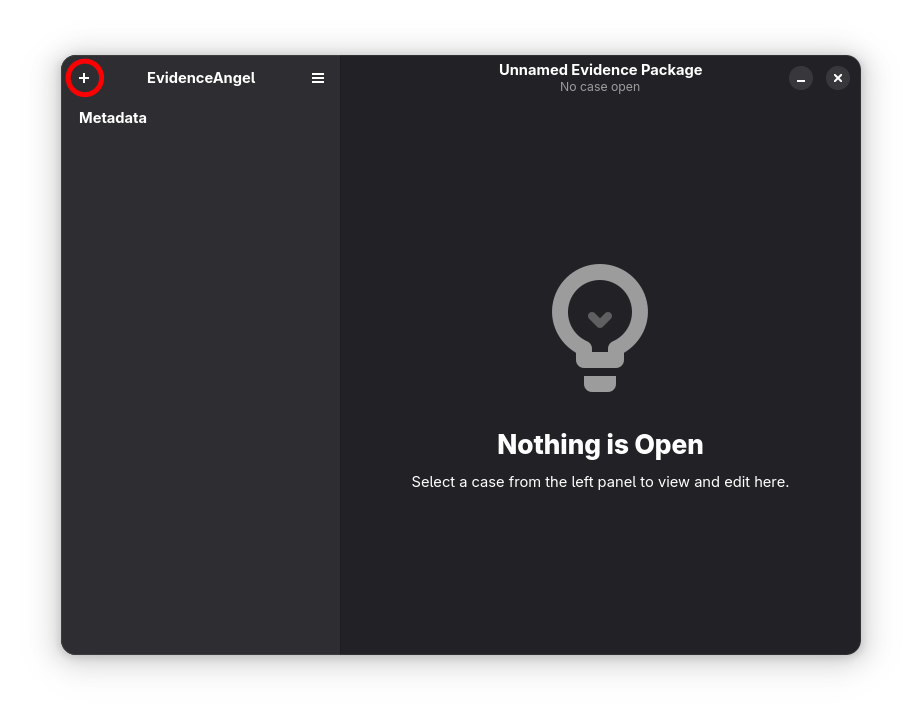
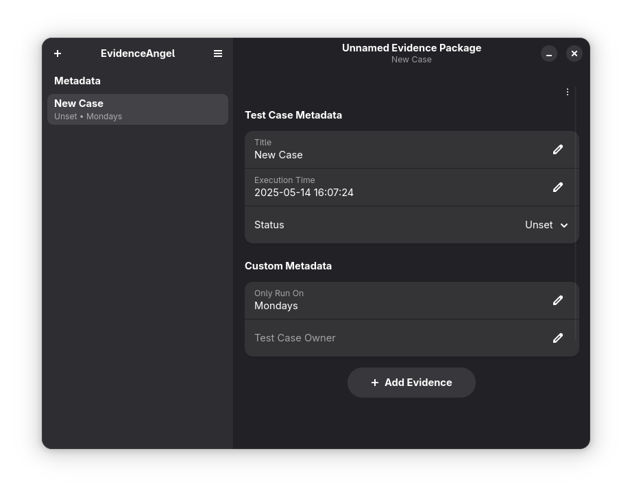
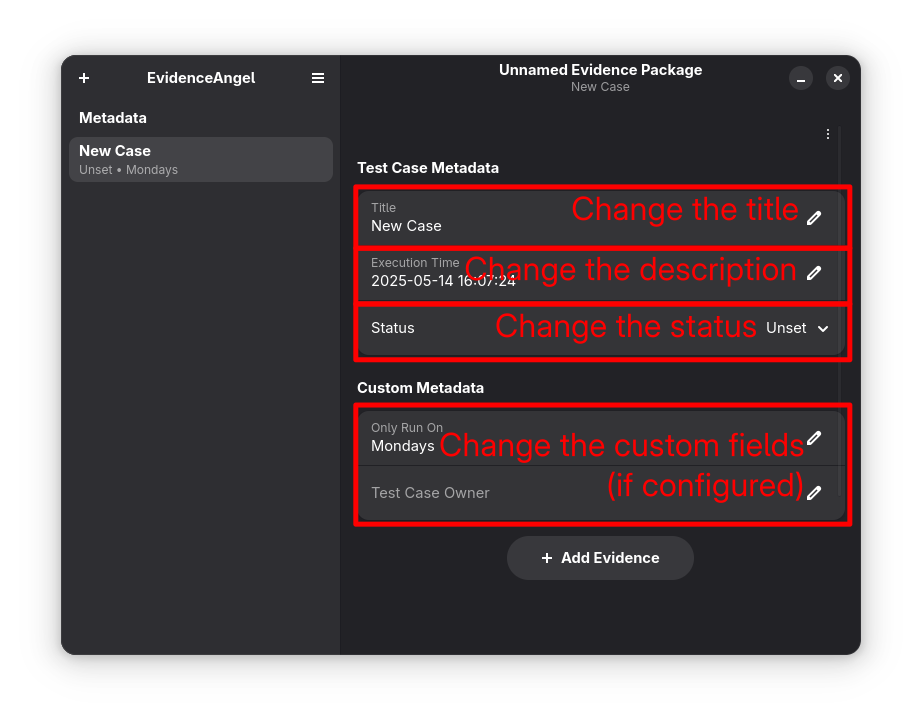
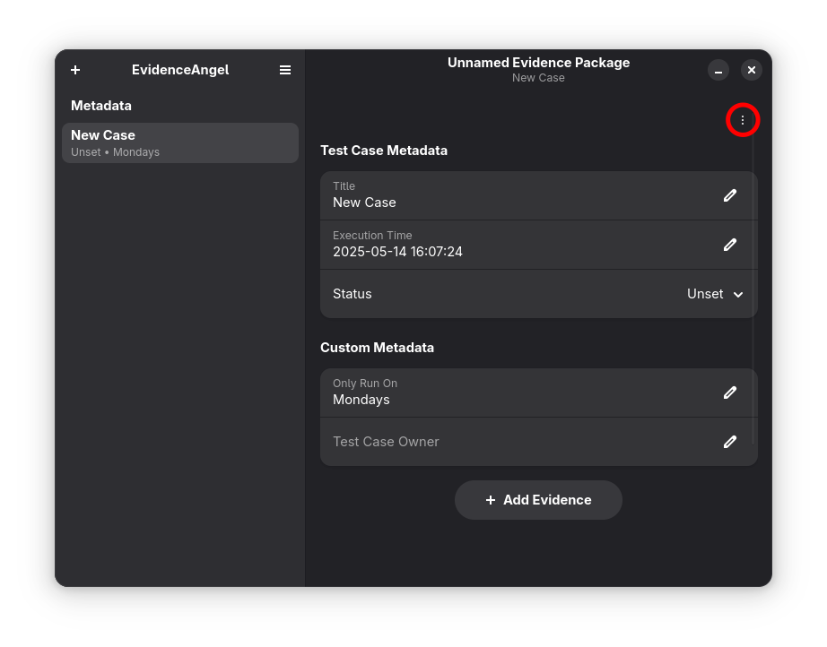

# Creating a Test Case

Once you have an open [_evidence
package_](./glossary.md#evidence-package), to create a new [_test
case_](./glossary.html#test-case):

1. Select the "+" button in the top left.

   
1. A new _test case_ is created and opened.

   
1. You can rename the _test case_ and change it's execution time in the
   text boxes at the top. You can also set if it has passed/failed, and,
   if you have [set up custom metadata
   fields](./creating_a_package.md#custom-metadata-fields), you can
   change their values.

   
1. See the "&bull;" in the title? That tells you that this _evidence
   package_ needs saving. <kbd>Ctrl+S</kbd> (or <kbd>Cmd+S</kbd> on Mac)
   will do this &ndash; save regularly!

   
1. You can now continue by [taking some
   _evidence_](./taking_evidence.md).

## Deleting a Test Case

To delete a _test case_:

1. Select the actions menu in the top right:

   
1. Select "Delete Test Case".
