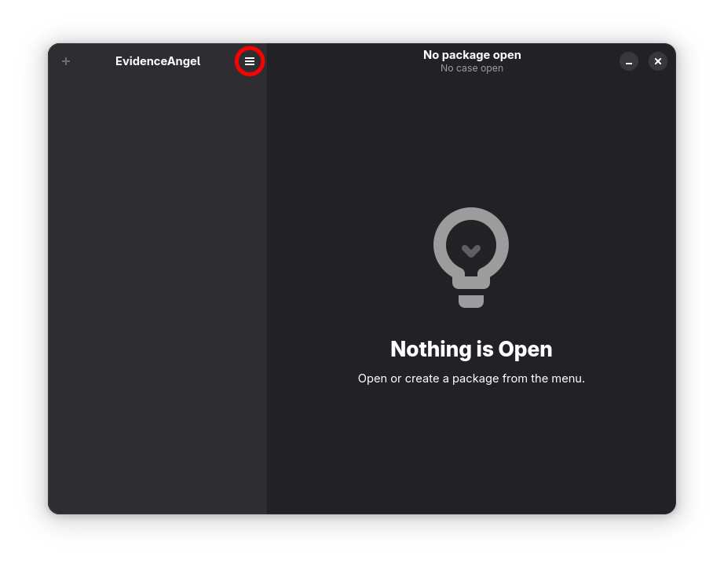
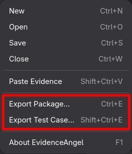
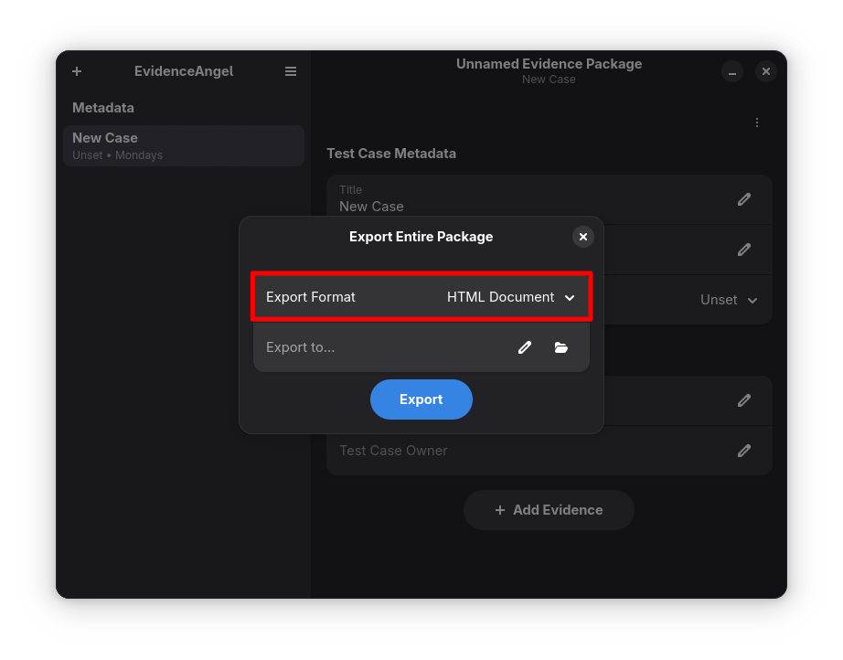
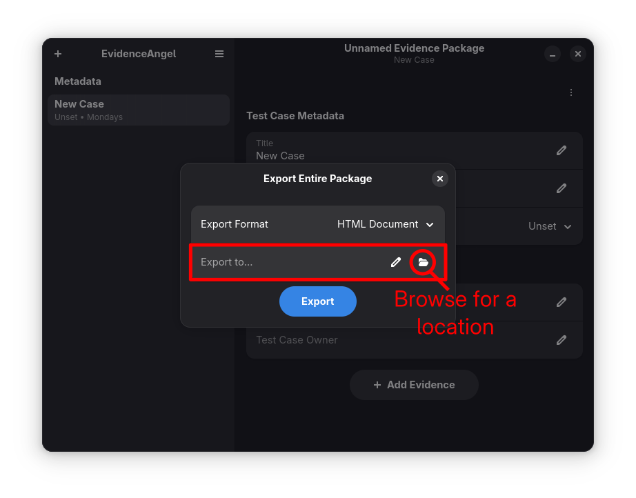

# Exporting Evidence

One of the key benefits to using EvidenceAngel is that [_evidence
packages_](./glossary.md#evidence-package) and [_test
cases_](./glossary.md#test-case) can be exported to common formats for
other people to view the data. This means that not everyone who might
need to review the evidence needs to have EvidenceAngel.

To export data:

Note: when exporting, the _evidence package_ will be automatically saved
if needed!

1. Select the main menu.

   
1. Select either "Export Package…" (to export the entire _evidence
   package_) or "Export Test Case…" (to export the currently open _test
   case_).

   
1. Select the desired format to export to.

   
1. Type a file path, or select the folder button.

   
1. Press "Export" (note that this might say "Save and Export" if the
   package needs saving, or "Overwrite" if the export target file
   already exists).
1. A confirmation appears. If you wish, you can open the exported file
   by clicking "Open".
