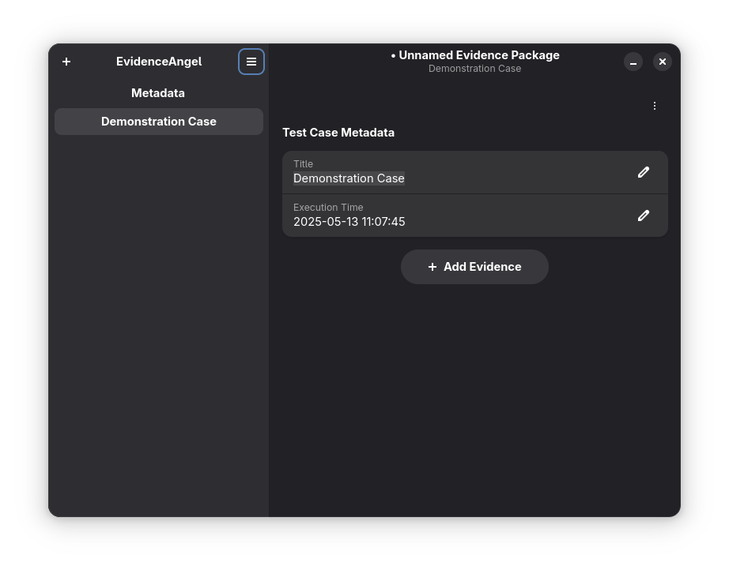
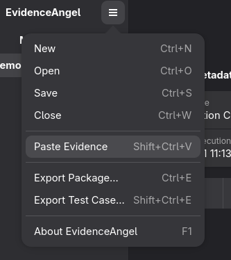
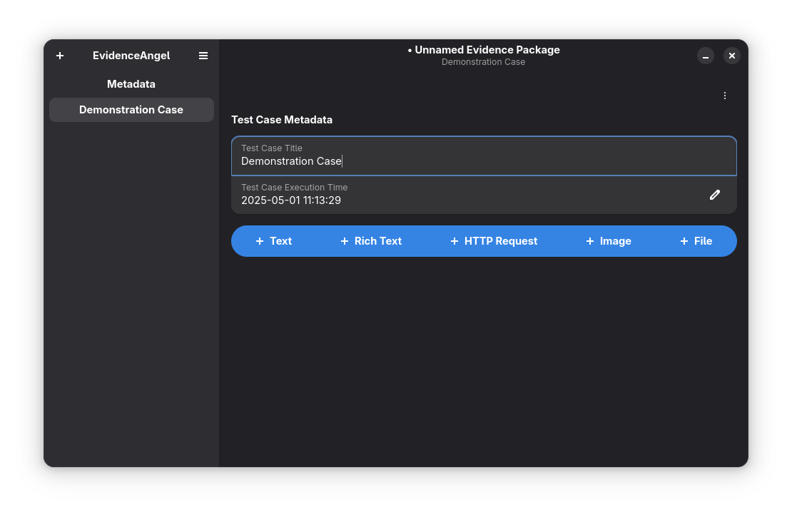

# Taking Evidence

Taking [_evidence_](./glossary.md#evidence) is a key part of EvidenceAngel, so
there are a number of ways to do it.

## Pasting Evidence from the Clipboard

Many kinds of evidence can be pasted from the clipboard. To do this, either
press <kbd>Ctrl+Shift+V</kbd>, or follow these steps:

1. Select the main menu.

   
1. Select "Paste Evidence".

   

## Inserting Evidence

1. Select the "+ Add Evidence" button.

   
1. Select the type of _evidence_ you wish to add.
1. Follow the steps to add the _evidence_.

### Supported Evidence

**Text**: plain text, useful for quick annotations and blocks of code.

**Rich Text**: text with formatting options, useful for text with certain parts
that need emphasis.

**HTTP Request**: a separated request/response field for tidier formatting of
web requests.

**Image**: an image, embedded into the _test case_.

**File**: a file of any type, embedded into the _test case_.

## Manipulating Evidence

You can also reorder evidence by drag-and-drop, or by clicking the arrow in the
top right of the evidence and selecting "Move Up" or "Move Down". You can also
delete evidence from this menu.
